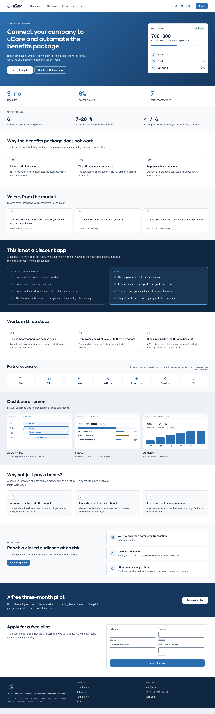
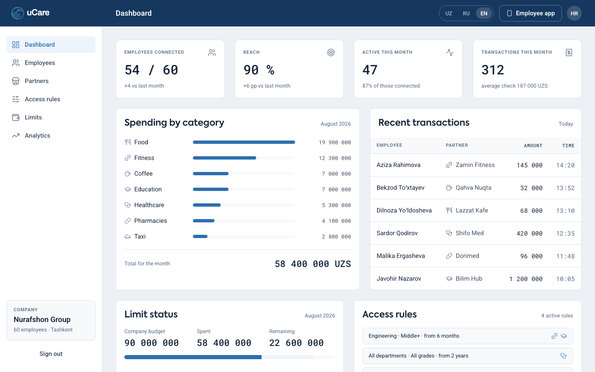
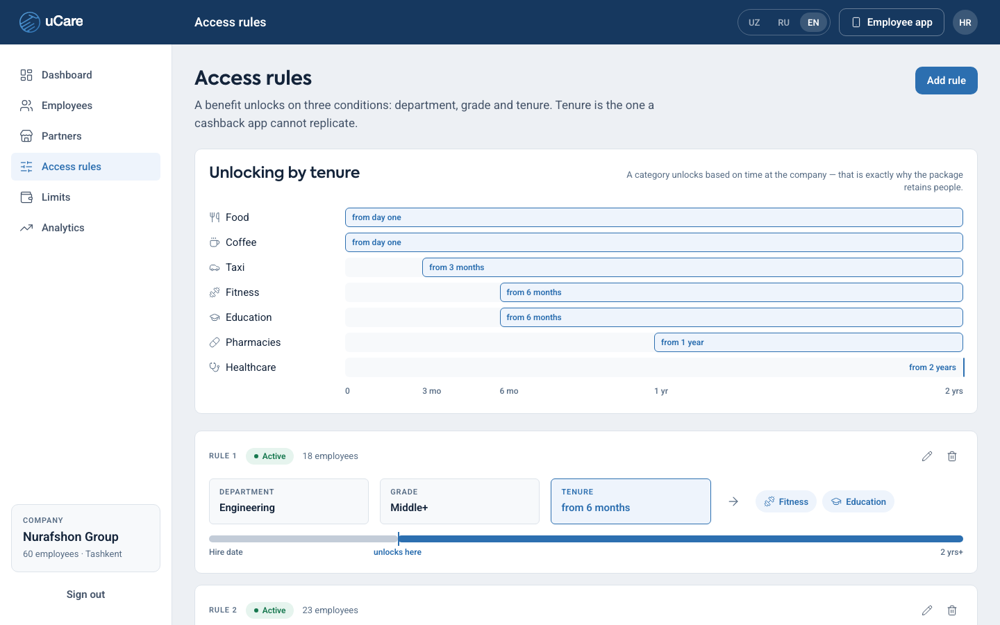
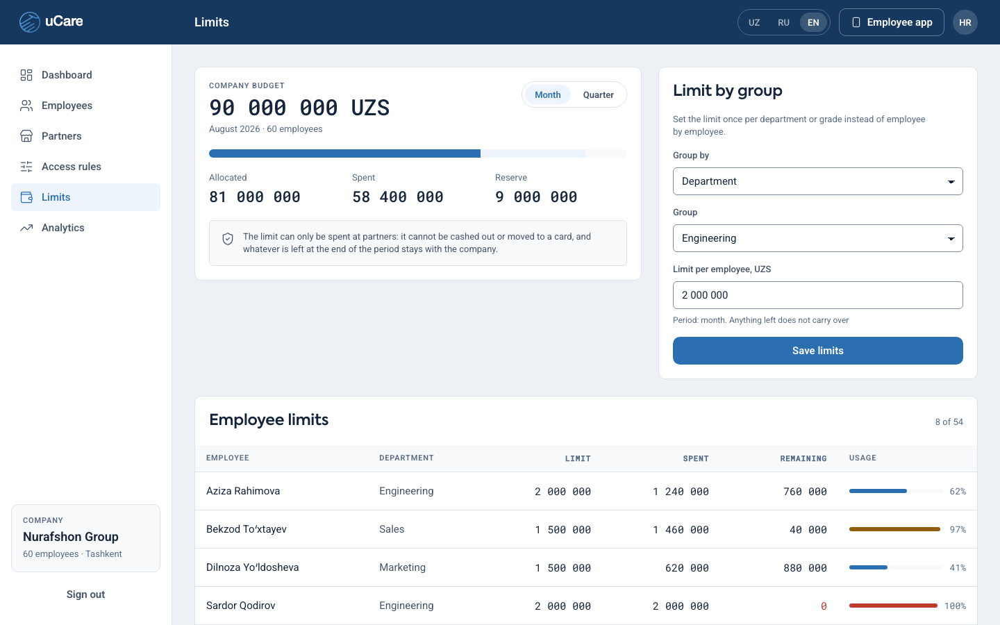
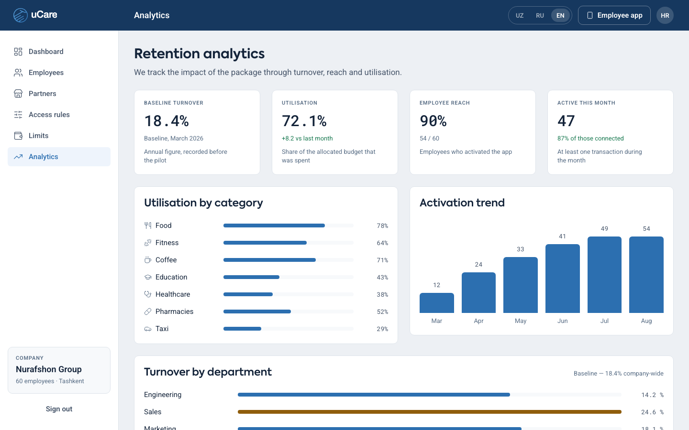
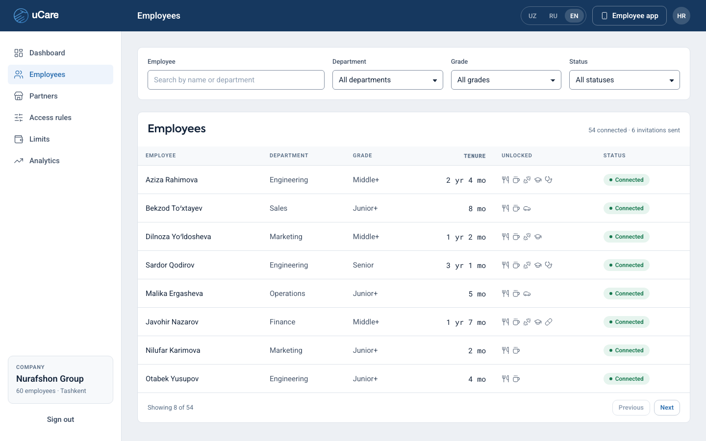
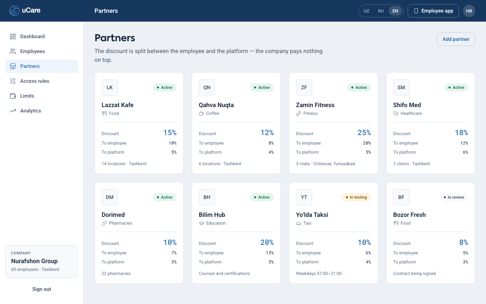
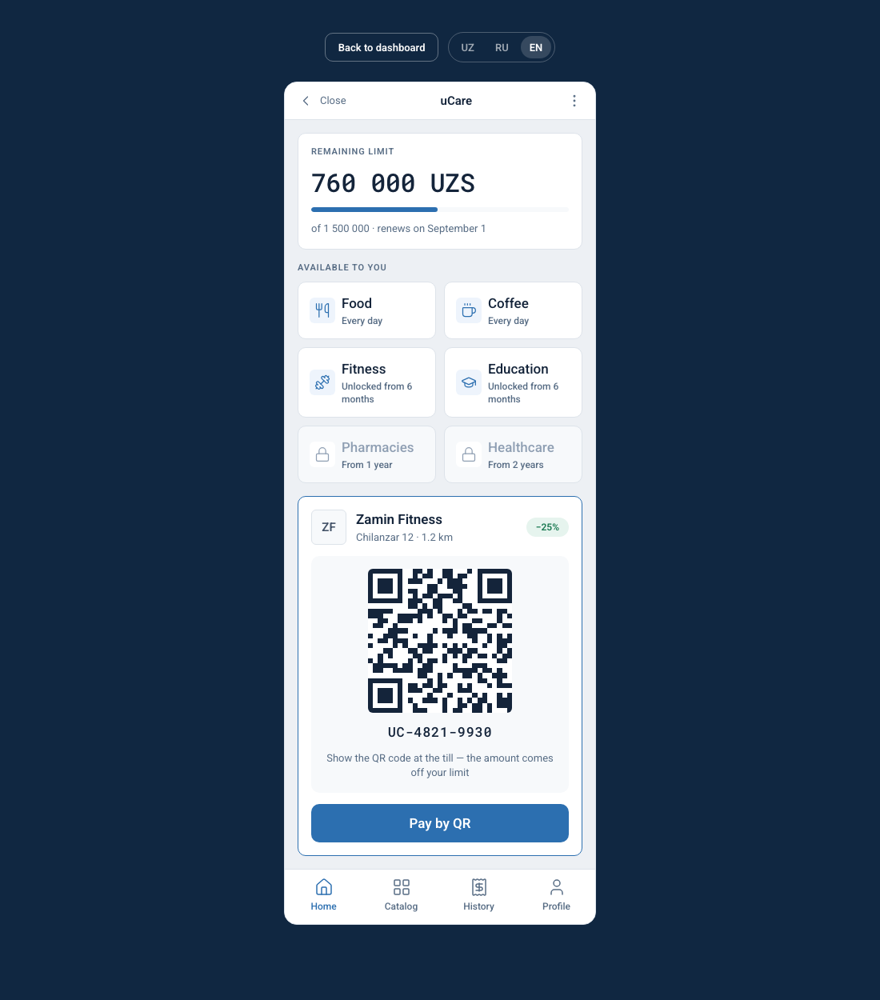

# uCare

**uCare** is a corporate benefits platform for companies in Uzbekistan. The company sets access
rules (department, grade, tenure), the employee sees only the categories unlocked for them plus
their remaining limit, and pays a partner by QR code at a discount.

The interface ships in three languages: Uzbek (default), Russian and English.

---

## Screenshots

| Landing | HR dashboard |
|---|---|
|  |  |

| Access rules | Limits |
|---|---|
|  |  |

| Analytics | Employees |
|---|---|
|  |  |

| Partners | Employee app |
|---|---|
|  |  |

---

## Stack

| | |
|---|---|
| Build | Vite 8 |
| UI | React 19, TypeScript |
| Styles | CSS custom properties + Tailwind 4 (prefixed `tw:`) |
| Routing | React Router 7 |
| Icons | lucide-react, 1.5px stroke on a 24 grid |
| Fonts | Axiforma (self-hosted), Roboto and Roboto Mono (Google Fonts) |

## Getting started

```bash
npm install
```

```bash
npm run dev
```

Build and preview the production bundle:

```bash
npm run build && npm run preview
```

## Routes

| Path | Screen |
|---|---|
| `/` | Landing: hero, market research, how it differs from cashback, categories, dashboard previews, pilot request form |
| `/app/dashboard` | HR dashboard: metrics, spend by category, transaction feed, limit status |
| `/app/people` | Employees: filters and table |
| `/app/partners` | Partners: cards with the discount and how it is split |
| `/app/rules` | Access rules: rule builder, tenure ladder, access matrix |
| `/app/limits` | Limits: budget per month or quarter, limit by group, per-employee table |
| `/app/analytics` | Analytics: utilisation, activation trend, turnover by department |
| `/employee` | Employee app: remaining limit, unlocked categories, QR payment |

## Layout

```
public/
  fonts/            Axiforma: Book 400, Medium 500, SemiBold 600, Bold 700
  *.svg             logos and the app icon
src/
  styles/
    tokens.css      every token: colours, type, spacing, radii, motion
    components.css  uc-* component classes
    index.css       entry point: tokens → components → Tailwind
  layout/
    useContainerWidth.ts  measures the canvas width
    breakpoints.ts        mob/tab/desktop → values from tokens.css
    Shell.tsx             root container, hands layout down to pages
    CabinetProvider.tsx   rules and budget period, shared across dashboard screens
  i18n/             uz.ts, ru.ts, en.ts, context and provider; Uzbek by default
  mock/             static data, one file per section, plus derive.ts
  components/
    ds/             Button, IconButton, Input, Select, Icon
    layout/         AppLayout, LangSwitch, ToastProvider
    landing/        landing sections
  pages/            Landing, Employee, makeQr, app/*
docs/screenshots/   PNGs used by this README
```

## Tokens

Every colour, radius, font, spacing step and duration lives in
[`src/styles/tokens.css`](src/styles/tokens.css) as a CSS custom property. **Components must not
contain literals** — no `#fff`, no `600 15px/22px`, no `48px`.

The file has two halves:

1. The design system itself — colours, typography, grid, shape and motion.
2. Layout tokens: white at various opacities for brand surfaces (`--on-brand-*`), fixed shell sizes
   (`--sidebar-w`, `--hero-aside-w`), font shorthands (`--text-amount-l`, `--text-btn`, …) and the
   per-breakpoint paddings and grids (`--pad-sec`, `--grid-3`, …).

Components do not read layout values directly. They go through
[`src/layout/breakpoints.ts`](src/layout/breakpoints.ts), which returns `var(--…)` references
keyed by breakpoint.

## Responsive behaviour

The layout switches on the width of its own container rather than the viewport: a `ResizeObserver`
plus a `resize` listener feed [`useContainerWidth`](src/layout/useContainerWidth.ts). That keeps the
breakpoints meaningful when the app is embedded or previewed inside a frame. Breakpoints: `< 720`
mobile, `720…1100` tablet, `≥ 1100` desktop.

## Dashboard shell

`/app/*` is a classic app shell: the container is exactly one viewport tall (`100dvh`) and never
scrolls itself — only `<main>` does. The top bar and the side navigation always stay put, and the
company card and **Sign out** sit at the bottom of the sidebar without scrolling. On a short
viewport the sidebar scrolls rather than the page.

The landing page and the employee app scroll normally; this applies to the dashboard only.

## Tailwind

Tailwind is loaded as two layers and **without preflight**:

```css
@layer theme, base, components, utilities;
@import "tailwindcss/theme.css" layer(theme) prefix(tw);
@import "tailwindcss/utilities.css" layer(utilities) prefix(tw);
```

- **No preflight**, because its reset changes layout: `svg{display:block}` removes the baseline of
  an inline icon, pushing any row containing one 5px lower — on the landing page that accumulated
  into a 22px drift by the footer. The design system ships its own reset in `tokens.css`.
- **Prefixed `tw:`**, because otherwise the utilities collide with design-system class names:
  Tailwind's `overline` is `text-decoration-line: overline` and drew a line above every overline
  label.

Tokens are exposed through `@theme`, so utilities resolve to the same variables: `tw:bg-surface`,
`tw:text-accent`, `tw:rounded-md`.

## Internationalisation

Dictionaries live in [`src/i18n/`](src/i18n): [`uz.ts`](src/i18n/uz.ts) (default),
[`ru.ts`](src/i18n/ru.ts) and [`en.ts`](src/i18n/en.ts) — 176 keys, 295 strings each. Uzbek defines
the shape: the other two are typed as `Dict`, so a missing or extra key fails at `tsc` rather than
at runtime. The selected language is kept in `localStorage` and mirrored onto `<html lang>`.

The switcher appears on all three surfaces — landing header, dashboard top bar and employee screen.

Mocks are language-neutral: they store keys and numbers, and the strings come from the dictionary.
An employee record holds `dept: 3`, and the caption is read from `t.depts[3]`.

Two caveats when adding a language:

- **Array lengths are not type-checked.** `Dict` widens tuples to plain arrays, so an array of the
  wrong length compiles fine and shows up as `undefined` at runtime. Keep the counts and the order
  identical across dictionaries.
- **Number formatting is locale-aware** through the `decimalSeparator` key, used by `formatDecimal`
  in [`src/mock/derive.ts`](src/mock/derive.ts). Thousands stay space-separated in every locale, so
  the tabular figures in the tables keep lining up.

## Data

There is no backend. Each section has a file in `src/mock/`: `landing`, `dashboard`, `rules`,
`limits`, `partners`, `analytics`, `people`, `employee`, plus the shared `categories` and `org`.
Derived values — totals, percentages, bar widths, the tenure ladder layout and colour thresholds —
are collected in [`src/mock/derive.ts`](src/mock/derive.ts) so the same number is never computed two
slightly different ways.

## Deployment

**Production:** https://www.ucare.uz

The apex `ucare.uz` redirects to `www` (308). The deployment address `ucare-coral.vercel.app` keeps
working as well.

Hosting is Vercel with automatic deploys from `main`; every branch and pull request gets its own
preview URL.

The app is a SPA on `BrowserRouter`, so [`vercel.json`](vercel.json) rewrites all paths to
`/index.html`. Without it a direct visit or a refresh on `/app/dashboard` would return 404. Static
files are unaffected: Vercel looks for the file in `dist/` first and only falls back to the rewrite.

No environment variables. The build is `npm ci && npm run build`, output goes to `dist/`.
